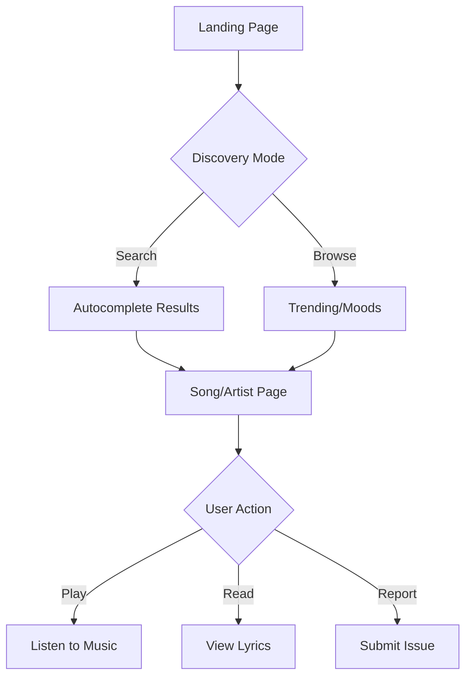
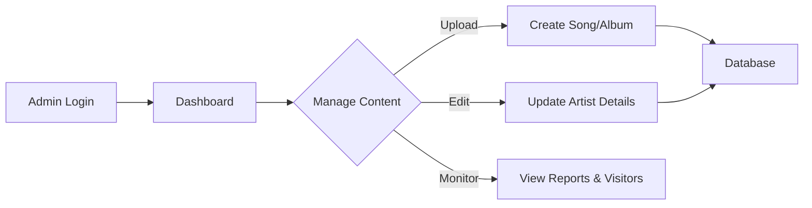

# MusicPHP - Music & Media Management System

<p align="center">
  
  
  
  
  
</p>

<p align="center">
  A modern, feature-rich music and media management system built with Laravel 10. Designed for seamless music discovery, listening, and comprehensive content management.
</p>

---

## :sparkles: Features

### :globe_with_meridians: **Public Frontend**
- **Premium UX**: Responsive design with glassmorphism effects and smooth transitions.
- **Music Discovery**: View trending songs by **Today**, **Week**, or **Month**.
- **Mood Playlists**: Curated sections like *Love Songs*, *Sad Songs*, and *Trending on TikTok*.
- **Advanced Search**: Real-time autocomplete to find artists, albums, and songs instantly.
- **Media Library**: Detailed profile pages for Artists. Albums, and Songs with lyrics.
- **User Engagement**: Report broken content, view upcoming lyrics, and subscribe to updates.

### :wrench: **Admin Panel**
- **Dashboard Overview**: Track visitor stats, total songs, and artist counts.
- **Content Management**: Full CRUD for Artists, Albums, Songs, Movies, and Genres.
- **Reports Handling**: Manage user reports for broken songs or incorrect lyrics.
- **Monetization**: Integrated Ad Manager to control advertisement placements.
- **Settings**: Configure site metadata, contact info, and SEO settings.
- **Visitor Tracker**: Analytics to monitor site traffic and usage.

### :lock: **Security & Optimization**
- **Authentication**: Secure admin login and session management.
- **Validation**: Server-side form validation for all inputs.
- **SEO Optimized**: Dynamic meta tags and OpenGraph support for better sharing.

---

## :building_construction: Tech Stack

| Layer | Technology | Purpose |
|-------|-----------|---------|
| **Backend** | Laravel 10.x | Core framework, routing, MVC architecture |
| **Frontend** | Blade Templates | Server-side rendering of views |
| **Styling** | Custom CSS3 | Glassmorphism design system with variables |
| **Database** | MySQL 8.0 | Relational data storage |
| **Scripting** | Vanilla JS | Interactive elements and search |
| **Fonts** | Poppins & Noto Sans | Typography (English & Nepali support) |

---

## :file_folder: Project Structure

```
musicphp/
├── app/
│   ├── Http/
│   │   ├── Controllers/       # Admin & Public Controllers
│   │   └── Middleware/        # Auth & Role Middleware
│   ├── Models/                # Eloquent Models (Song, Album, Artist)
│   └── Providers/             # Service Providers
├── config/                    # Application Configuration
├── database/
│   ├── migrations/            # Database Schema Definitions
│   └── seeders/               # Test Data Generators
├── public/
│   ├── css/                   # Custom Stylesheets
│   ├── images/                # Static Assets & Uploads
│   └── js/                    # Frontend Scripts
├── resources/
│   └── views/
│       ├── admin/             # Dashboard Views
│       ├── layouts/           # Master Blade Layouts
│       └── ...                # Public Frontend Views
└── routes/
    └── web.php                # Application Routes
```

---

## :arrows_counterclockwise: Application Workflow

### 1. **User Discovery Flow**


```mermaid
graph TD
    A[Landing Page] --> B{Discovery Mode}
    B -->|Search| C[Autocomplete Results]
    B -->|Browse| D[Trending/Moods]
    C --> E[Song/Artist Page]
    D --> E
    E --> F{User Action}
    F -->|Play| G[Listen to Music]
    F -->|Read| H[View Lyrics]
    F -->|Report| I[Submit Issue]
```

### 2. **Admin Management Flow**


```mermaid
graph LR
    A[Admin Login] --> B[Dashboard]
    B --> C{Manage Content}
    C -->|Upload| D[Create Song/Album]
    C -->|Edit| E[Update Artist Details]
    C -->|Monitor| F[View Reports & Visitors]
    D --> G[Database]
    E --> G
```

---

## :rocket: Installation

### Prerequisites
- PHP >= 8.1
- Composer
- MySQL

### Steps

1. **Clone the repository**
   ```bash
   git clone https://github.com/yourusername/musicphp.git
   cd musicphp
   ```

2. **Install dependencies**
   ```bash
   composer install
   ```

3. **Configure environment**
   ```bash
   cp .env.example .env
   php artisan key:generate
   ```

4. **Update `.env` file**
   Set your database credentials:
   ```env
   DB_CONNECTION=mysql
   DB_HOST=127.0.0.1
   DB_PORT=3306
   DB_DATABASE=musicphp
   DB_USERNAME=root
   DB_PASSWORD=
   ```

5. **Run migrations**
   ```bash
   php artisan migrate
   ```

6. **Start development server**
   ```bash
   php artisan serve
   ```

7. **Access the application**
   - Public Site: `http://127.0.0.1:8000`
   - Admin Panel: `http://127.0.0.1:8000/admin/login`

---

## :computer: Running on LAN (Local Network Access)

To make your application accessible on your local network:

1. **Find your local IP address**
   ```bash
   # On macOS/Linux
   ifconfig | grep "inet "
   
   # On Windows
   ipconfig
   ```

2. **Start server with host binding**
   ```bash
   php artisan serve --host=YOUR_LOCAL_IP --port=8000
   ```
   Example: `php artisan serve --host=192.168.1.107 --port=8000`

3. **Update `.env` file**
   ```env
   APP_URL=http://192.168.1.107:8000
   ```

4. **Access from other devices**
   - Open `http://YOUR_LOCAL_IP:8000` from any device on the same network
   - Ensure your firewall allows incoming connections on port 8000

---

## :cloud: Deployment to Shared Hosting (Hostinger)

### Prerequisites
- cPanel access
- PHP 8.1+ enabled
- MySQL database created

### Deployment Steps

1. **Prepare your files**
   ```bash
   # Remove development dependencies
   composer install --optimize-autoloader --no-dev
   
   # Clear caches
   php artisan config:clear
   php artisan cache:clear
   ```

2. **Upload files via FTP/File Manager**
   - Upload all files to `public_html/`
   - Move contents of `public/` folder to `public_html/`
   - Move everything else to a folder outside `public_html/` (e.g., `laravel/`)

3. **Update `public_html/index.php`**
   Change the paths to point to your Laravel folder:
   ```php
   require __DIR__.'/../laravel/vendor/autoload.php';
   $app = require_once __DIR__.'/../laravel/bootstrap/app.php';
   ```

4. **Create `.env` file on server**
   ```env
   APP_ENV=production
   APP_DEBUG=false
   APP_URL=https://yourdomain.com
   APP_KEY=your-generated-key
   
   DB_CONNECTION=mysql
   DB_HOST=localhost
   DB_PORT=3306
   DB_DATABASE=your_database_name
   DB_USERNAME=your_database_user
   DB_PASSWORD=your_database_password
   ```

5. **Set file permissions via cPanel**
   - `storage/` → 755 or 775
   - `bootstrap/cache/` → 755 or 775

6. **Run essential commands via SSH or Terminal in cPanel**
   ```bash
   cd laravel
   php artisan key:generate
   php artisan storage:link
   php artisan migrate --force
   php artisan config:cache
   php artisan route:cache
   php artisan view:cache
   ```

7. **Verify database connection**
   - Check that your database credentials in `.env` match your cPanel database settings
   - Ensure database user has all privileges

### Important Notes
- **Never commit `.env`** to version control
- **Disable debug mode** in production (`APP_DEBUG=false`)
- **Use HTTPS** for production sites
- **Keep storage writable** for file uploads

---

## :warning: Troubleshooting

### HTTP 500 Error After Deployment

**Causes & Solutions:**

1. **Missing `.env` file**
   - Create `.env` file with production settings
   - Run `php artisan key:generate`

2. **Wrong file permissions**
   ```bash
   chmod -R 755 storage bootstrap/cache
   ```

3. **Missing storage symlink**
   ```bash
   php artisan storage:link
   ```

4. **Database connection failed**
   - Verify credentials in `.env`
   - Check database host (use `localhost` on shared hosting)
   - Ensure database user has correct privileges

5. **Cached configuration**
   ```bash
   php artisan config:clear
   php artisan cache:clear
   php artisan view:clear
   ```

### Images Not Displaying

1. **Check storage symlink exists**
   ```bash
   ls -la public/storage
   # Should point to ../storage/app/public
   ```

2. **Verify file permissions**
   ```bash
   chmod -R 755 storage/app/public
   ```

3. **Check image paths in code**
   - Use `asset('storage/...')` for public storage files
   - Use `Storage::url($path)` for dynamic paths

### 403 Forbidden Error

- Check `.htaccess` file exists in `public/` directory
- Verify directory permissions (should be 755)
- Ensure `index.php` has correct permissions (644)

### Check Server Logs

**On Hostinger:**
- cPanel → Files → Error Logs
- Or check `storage/logs/laravel.log`

**Common log locations:**
```
storage/logs/laravel.log
/var/log/apache2/error.log (if you have access)
```

### PHP Version Issues

- Verify PHP version in cPanel matches requirements (8.1+)
- Update `.htaccess` if needed:
  ```apache
  # Force PHP 8.1
  AddHandler application/x-httpd-php81 .php
  ```

---

## :art: Design System

### Color Palette
```css
:root {
    --color-primary: #2563eb;       /* Blue-600 */
    --color-accent: #7c3aed;        /* Violet-600 */
    --color-bg: #f8fafc;            /* Slate-50 */
    --color-surface: #ffffff;       /* White */
    --color-text-primary: #111827;  /* Gray-900 */
    --gradient-hero: linear-gradient(135deg, #667eea 0%, #764ba2 50%, #f093fb 100%);
}
```

### Typography
- **Headings**: `Poppins` (Bold, ExtraBold)
- **Body**: `Poppins` (Regular)
- **Nepali Text**: `Noto Sans Devanagari`

---

## :shield: Security

- **Restricted Admin Access**: Middleware protection for admin routes.
- **CSRF Protection**: All forms secured with Laravel tokens.
- **Input Sanitization**: Built-in protection against SQL injection and XSS.

---

## :page_facing_up: License

The MusicPHP project is open-sourced software licensed under the [MIT license](https://opensource.org/licenses/MIT).

---

<p align="center">Made with ❤️ by Prabhakar Khatri</p>
