# MusicPHP - Music & Media Management System

<p align="center">
  
  
  
  
  
</p>

<p align="center">
  A modern, feature-rich music and media management system built with Laravel 10. Designed for seamless music discovery, listening, and comprehensive content management.
</p>

---

## ✨ Features

### 🎤 **Artist Management System**

#### Admin Artist Dashboard
The artist management system provides a complete workflow for managing artists with verification, credentials, and social media integration:

- **Unified Artist Directory**: Browse all artists with real-time statistics (song count, view count, verification status)
- **Advanced Search**: Search artists by English or Nepali names
- **Artist Profile Creation**:
  - Bilingual names (English + Nepali/Devanagari)
  - Biography and date of birth
  - Profile image (300x300px recommended) and cover image (1200x400px recommended)
  - Social media links (YouTube, Facebook, Instagram, TikTok, Spotify, Apple Music, Website, Public Email)
  - Verification badge system
  
- **Account Credentials Management**:
  - Optional user account creation during artist profile setup
  - Separate modal for updating email and password for existing artists
  - Role-based access control (Artist, Admin)
  - Security safeguards to prevent accidental modification of admin accounts
  
- **Verification System**: Mark artists as verified with a prominent badge displayed across the platform
- **View Tracking**: Automatic view counting for artist profiles
- **Statistics Dashboard**: Real-time metrics showing total artists, verified count, and total songs

#### Artist Registration Requests
Public artists can submit registration requests through a dedicated form:
- Admin review queue for pending requests
- **Approve**: Automatically creates user account and artist profile
- **Reject**: Declines the request
- Temporary password generation for new accounts (ready for email integration)

---

### 🏠 **Public Frontend**

#### Music Discovery
- **Homepage**: Featured sections including trending songs, new releases, and mood-based playlists
- **Trending System**: 
  - View trending songs by **Today**, **This Week**, or **This Month**
  - View count-based ranking algorithm
- **New Releases**: Browse songs by release year
- **Top Artists**: Discover popular artists by total views

#### Mood-Based Playlists
Curated collections to match user moods:
- 💕 Love Songs
- 😢 Sad Songs
- 💏 Romantic Songs
- 🎉 Party Songs
- 🎵 Trending on TikTok

#### Advanced Search
- **Real-time Autocomplete**: Instant suggestions as you type
- Search across artists, albums, songs, and movies
- Bilingual search support (English and Nepali)

#### Media Library
- **Artist Profiles**: 
  - Complete biography and social media links
  - Top songs by view count
  - Full discography
  - Profile and cover images
  
- **Song Pages**:
  - Full lyrics display (Nepali and English)
  - YouTube embed integration
  - Artist information with linked profile
  - Album, genre, and movie associations
  - Tags for enhanced discoverability
  - Related songs suggestions
  - View counter
  - **Print-Ready Lyrics**: Dedicated print layout with branding watermark, clean typography, and auto-print trigger
  
- **Albums**: Browse and view album details with complete tracklists
- **Movies**: Browse Nepali movies with associated soundtracks
- **Genres**: Filter songs by genre

#### User Engagement
- **Report System**: Users can report broken songs or incorrect lyrics
- **Upcoming Lyrics**: View songs that will get lyrics added soon
- **Newsletter Subscription**: Subscribe for updates on new lyrics
- **Contact Form**: Direct communication channel to site administrators

---

### 🎛️ **Admin Panel**

#### Dashboard Overview
Comprehensive metrics at a glance:
- Total songs, artists, albums, movies, genres
- Total views across the platform
- Visitor statistics and traffic analytics
- Quick access to all management sections

#### Content Management

**Songs Management**:
- Full CRUD operations (Create, Read, Update, Delete)
- **Features**:
  - Bilingual song titles (English + Nepali)
  - Multiple artist support (for collaborations)
  - Album and movie associations
  - Genre and tag assignments
  - YouTube link integration
  - Full Nepali and English lyrics support
  - Tablature/chords support
  - Release year tracking
  - Publish/unpublish toggle
  - Featured song designation
  - **Soft Delete**: Songs can be moved to trash and restored
  - **Permanent Delete**: Force delete for complete removal
- Advanced search and filtering
- Pagination for large datasets

**Albums Management**:
- Album creation with cover art
- Artist association
- Release year and description
- Track management

**Movies Management**:
- Movie profiles with poster images
- Release year and description
- Associated soundtrack songs

**Genres Management**:
- Create and manage music genres
- Automatic song count tracking

#### Reports & Moderation
- **User Reports**: Review and manage user-submitted reports for broken content
- **Status Tracking**: Mark reports as Pending, Reviewed, or Resolved
- **Detailed View**: See full report context with linked song information

#### Contact Management
- View all contact form submissions
- **Status System**: Pending, Read, Replied
- Reply to inquiries
- Delete processed contacts

#### Subscription Management
- View newsletter subscribers
- Export subscriber list
- Manage subscription status

#### Visitor Analytics
- Real-time visitor tracking
- IP address, user agent, and timestamp logging
- Page visit tracking
- Refresh functionality for live updates

#### Artist Request Management
- Review public artist registration requests
- Approve or reject applications
- Automatic user and artist profile creation on approval

#### Password Reset Requests
- Admin queue for password reset requests
- Mark as resolved or delete requests

#### Settings & Configuration
- **Site Settings**:
  - Site name, tagline, and description
  - Contact email and phone
  - Social media links
  - SEO meta tags
  
- **Ad Manager**: (Feature removed - clean codebase)

---

### 🎨 **Artist Panel** (Self-Service Portal)

Artists with accounts can log in to manage their own content:

#### Dashboard
- Personal statistics overview
- Recent songs and albums
- Quick actions

#### Profile Management
- Update artist profile information
- Change profile and cover images
- Update biography and social links
- Change password

#### Content Creation
- **Upload Songs**: Artists can add their own songs with lyrics
- **Create Albums**: Organize songs into albums
- **Edit Content**: Modify existing songs and albums

#### Utilities
- Romanization tool for converting Nepali text to English

---

### 🖨️ **Print Lyrics System**
Users can print any song's lyrics as a beautifully formatted, branded document:
- **Two Print Modes**: Unicode (Nepali script) and Romanized (English transliteration)
- **Professional Layout**: `Crimson Pro` serif font for lyrics with centered header and metadata
- **Site Watermark**: Logo embedded as a translucent diagonal watermark using `position: fixed`
- **Auto-Print**: JavaScript `window.onload` triggers the browser print dialog automatically
- **Branded Footer**: Source URL and print date included at the bottom of every page
- **Print-Optimized CSS**: `@page` margins, `page-break-inside: avoid` on lyric lines, and `@media print` overrides for clean output

---

### 🔒 **Security & Optimization**
- **Authentication**: Secure admin login and session management.
- **Validation**: Server-side form validation for all inputs.
- **SEO Optimized**: Dynamic meta tags and OpenGraph support for better sharing.

---

## :building_construction: Tech Stack

| Layer | Technology | Purpose |
|-------|-----------|---------|
| **Backend** | Laravel 10.x | Core framework, routing, MVC architecture |
| **Frontend** | Blade Templates | Server-side rendering of views |
| **Styling** | Custom CSS3 | Glassmorphism design system with variables |
| **Database** | MySQL 8.0 | Relational data storage |
| **Scripting** | Vanilla JS | Interactive elements and search |
| **Fonts** | Poppins & Noto Sans | Typography (English & Nepali support) |

---

## 🏗️ Project Structure

```
musicphp/
├── app/
│   ├── Http/
│   │   ├── Controllers/
│   │   │   ├── Admin/              # Admin Panel Controllers
│   │   │   │   ├── ArtistController.php        # Artist CRUD + credentials
│   │   │   │   ├── ArtistRequestController.php # Registration approval
│   │   │   │   ├── SongController.php          # Song management
│   │   │   │   ├── AlbumController.php         # Album management
│   │   │   │   ├── GenreController.php         # Genre management
│   │   │   │   ├── SettingsController.php      # Site settings + reports
│   │   │   │   ├── ContactController.php       # Contact moderation
│   │   │   │   └── VisitorController.php       # Analytics tracking
│   │   │   ├── Artist/             # Artist Panel Controllers
│   │   │   │   └── DashboardController.php     # Artist self-service
│   │   │   ├── HomeController.php              # Homepage + trending
│   │   │   ├── ArtistController.php            # Public profiles
│   │   │   └── SearchController.php            # Search + autocomplete
│   │   └── Middleware/
│   │       ├── AdminAuth.php       # Admin authentication
│   │       └── ArtistMiddleware.php # Artist verification
│   ├── Models/                     # Eloquent Models (18 models)
│   │   ├── Artist.php              # Artists with social links + verification
│   │   ├── Song.php                # Songs with soft deletes
│   │   ├── Album.php               # Albums
│   │   ├── User.php                # Authentication (admin/artist roles)
│   │   ├── Report.php              # User-submitted reports
│   │   └── ...
│   └── Providers/                  # Service Providers
├── database/
│   ├── migrations/                 # Database Schema
│   └── seeders/                    # Test Data
├── public/
│   ├── css/                        # Custom Stylesheets
│   ├── images/                     # Static Assets
│   ├── js/                         # Frontend Scripts
│   └── storage/                    # Symlink to uploads
│       ├── artists/
│       ├── albums/
│       └── songs/
├── resources/
│   └── views/
│       ├── admin/                  # Admin Panel (29 files)
│       │   ├── artists/
│       │   │   ├── index.blade.php
│       │   │   ├── create.blade.php
│       │   │   └── edit.blade.php
│       │   ├── artist-requests/
│       │   ├── songs/
│       │   ├── contacts/
│       │   └── dashboard.blade.php
│       ├── artist/                 # Artist Panel (11 files)
│       ├── artists/                # Public artist pages
│       ├── song/                   # Song pages with lyrics
│       └── home.blade.php
└── routes/
    └── web.php                     # 251 lines of routes
```

### Key Features by Layer

**Controllers (13 Admin + 8 Public)**
- Full CRUD for Artists, Songs, Albums, Movies, Genres
- Artist verification and credential management
- Content moderation (reports, contacts, password resets)
- Analytics and visitor tracking
- Artist self-service portal

**Models (18 total)**
- Artist, Song, Album, Movie, Genre, Tag
- User (role-based: admin/artist)
- Report, Contact, SongSubscription
- VisitLog, ArtistRegistrationRequest

**Database Tables**
- Complete bilingual support (English + Nepali)
- Soft deletes for songs
- Social links as JSON
- View counting system
- Status tracking for moderation workflows


---

## 🔄 Application Workflow

### 1. **Artist Registration & Management Pipeline**


### 2. **Content Management Workflow**


### 3. **User Discovery & Engagement Flow**

```mermaid
graph TD
    A[User Visits Site] --> B{Discovery Mode}
    
    B -->|Search| C[Autocomplete Search]
    C --> D[Search Results]
    D --> E[Song/Artist/Album Page]
    
    B -->|Browse| F{Browse Options}
    F -->|Trending| G[Trending Songs]
    F -->|Mood| H[Mood Playlists]
    F -->|New| I[New Releases]
    F -->|Top| J[Top Artists]
    
    G --> E
    H --> E
    I --> E
    J --> E
    
    E --> K{User Action}
    K -->|Listen| L[Play on YouTube]
    K -->|Read| M[View Lyrics]
    K -->|Report| N[Submit Report]
    K -->|Subscribe| O[Newsletter Signup]
    
    N --> P[Admin Reports Queue]
    P --> Q{Admin Review}
    Q -->|Fix| R[Update Content]
    Q -->|Resolve| S[Mark Resolved]
```



### 4. **Admin Content Moderation Flow**


### 5. **Print Lyrics Pipeline**

```mermaid
graph TD
    A[User on Song Page] -->|Clicks Print Button| B[/song/{artist}/{slug}/print/{type}]
    B --> C{Type}
    C -->|unicode| D[Fetch Nepali Lyrics]
    C -->|romanized| E[Fetch Romanized Lyrics]
    D --> F[print.blade.php]
    E --> F
    F --> G[Render Print-Optimized HTML]
    G --> H[Load Google Fonts]
    G --> I[Resolve Site Logo]
    I --> J[Embed as Fixed Watermark]
    G --> K[Split Lyrics by Line]
    K --> L{Empty Line?}
    L -->|Yes| M[Section Break div]
    L -->|No| N[Lyric Line div]
    M --> O[Assembled Document]
    N --> O
    O --> P[Footer: Source URL + Print Date]
    O --> Q[window.onload → window.print]
    Q --> R[Browser Print Dialog]
    R --> S[Printed / Saved as PDF]
```

---

## :rocket: Installation

### Prerequisites
- PHP >= 8.1
- Composer
- MySQL

### Steps

1. **Clone the repository**
   ```bash
   git clone https://github.com/yourusername/musicphp.git
   cd musicphp
   ```

2. **Install dependencies**
   ```bash
   composer install
   ```

3. **Configure environment**
   ```bash
   cp .env.example .env
   php artisan key:generate
   ```

4. **Update `.env` file**
   Set your database credentials:
   ```env
   DB_CONNECTION=mysql
   DB_HOST=127.0.0.1
   DB_PORT=3306
   DB_DATABASE=musicphp
   DB_USERNAME=root
   DB_PASSWORD=
   ```

5. **Run migrations**
   ```bash
   php artisan migrate
   ```

6. **Start development server**
   ```bash
   php artisan serve
   ```

7. **Access the application**
   - Public Site: `http://127.0.0.1:8000`
   - Admin Panel: `http://127.0.0.1:8000/admin/login`

---

## :computer: Running on LAN (Local Network Access)

To make your application accessible on your local network:

1. **Find your local IP address**
   ```bash
   # On macOS/Linux
   ifconfig | grep "inet "
   
   # On Windows
   ipconfig
   ```

2. **Start server with host binding**
   ```bash
   php artisan serve --host=YOUR_LOCAL_IP --port=8000
   ```
   Example: `php artisan serve --host=192.168.1.107 --port=8000`

3. **Update `.env` file**
   ```env
   APP_URL=http://192.168.1.107:8000
   ```

4. **Access from other devices**
   - Open `http://YOUR_LOCAL_IP:8000` from any device on the same network
   - Ensure your firewall allows incoming connections on port 8000

---

## :cloud: Deployment to Shared Hosting (Hostinger)

### Prerequisites
- cPanel access
- PHP 8.1+ enabled
- MySQL database created

### Deployment Steps

1. **Prepare your files**
   ```bash
   # Remove development dependencies
   composer install --optimize-autoloader --no-dev
   
   # Clear caches
   php artisan config:clear
   php artisan cache:clear
   ```

2. **Upload files via FTP/File Manager**
   - Upload all files to `public_html/`
   - Move contents of `public/` folder to `public_html/`
   - Move everything else to a folder outside `public_html/` (e.g., `laravel/`)

3. **Update `public_html/index.php`**
   Change the paths to point to your Laravel folder:
   ```php
   require __DIR__.'/../laravel/vendor/autoload.php';
   $app = require_once __DIR__.'/../laravel/bootstrap/app.php';
   ```

4. **Create `.env` file on server**
   ```env
   APP_ENV=production
   APP_DEBUG=false
   APP_URL=https://yourdomain.com
   APP_KEY=your-generated-key
   
   DB_CONNECTION=mysql
   DB_HOST=localhost
   DB_PORT=3306
   DB_DATABASE=your_database_name
   DB_USERNAME=your_database_user
   DB_PASSWORD=your_database_password
   ```

5. **Set file permissions via cPanel**
   - `storage/` → 755 or 775
   - `bootstrap/cache/` → 755 or 775

6. **Run essential commands via SSH or Terminal in cPanel**
   ```bash
   cd laravel
   php artisan key:generate
   php artisan storage:link
   php artisan migrate --force
   php artisan config:cache
   php artisan route:cache
   php artisan view:cache
   ```

7. **Verify database connection**
   - Check that your database credentials in `.env` match your cPanel database settings
   - Ensure database user has all privileges

### Important Notes
- **Never commit `.env`** to version control
- **Disable debug mode** in production (`APP_DEBUG=false`)
- **Use HTTPS** for production sites
- **Keep storage writable** for file uploads

---

## :warning: Troubleshooting

### HTTP 500 Error After Deployment

**Causes & Solutions:**

1. **Missing `.env` file**
   - Create `.env` file with production settings
   - Run `php artisan key:generate`

2. **Wrong file permissions**
   ```bash
   chmod -R 755 storage bootstrap/cache
   ```

3. **Missing storage symlink**
   ```bash
   php artisan storage:link
   ```

4. **Database connection failed**
   - Verify credentials in `.env`
   - Check database host (use `localhost` on shared hosting)
   - Ensure database user has correct privileges

5. **Cached configuration**
   ```bash
   php artisan config:clear
   php artisan cache:clear
   php artisan view:clear
   ```

### Images Not Displaying

1. **Check storage symlink exists**
   ```bash
   ls -la public/storage
   # Should point to ../storage/app/public
   ```

2. **Verify file permissions**
   ```bash
   chmod -R 755 storage/app/public
   ```

3. **Check image paths in code**
   - Use `asset('storage/...')` for public storage files
   - Use `Storage::url($path)` for dynamic paths

### 403 Forbidden Error

- Check `.htaccess` file exists in `public/` directory
- Verify directory permissions (should be 755)
- Ensure `index.php` has correct permissions (644)

### Check Server Logs

**On Hostinger:**
- cPanel → Files → Error Logs
- Or check `storage/logs/laravel.log`

**Common log locations:**
```
storage/logs/laravel.log
/var/log/apache2/error.log (if you have access)
```

### PHP Version Issues

- Verify PHP version in cPanel matches requirements (8.1+)
- Update `.htaccess` if needed:
  ```apache
  # Force PHP 8.1
  AddHandler application/x-httpd-php81 .php
  ```

---

## :art: Design System

### Color Palette
```css
:root {
    --color-primary: #2563eb;       /* Blue-600 */
    --color-accent: #7c3aed;        /* Violet-600 */
    --color-bg: #f8fafc;            /* Slate-50 */
    --color-surface: #ffffff;       /* White */
    --color-text-primary: #111827;  /* Gray-900 */
    --gradient-hero: linear-gradient(135deg, #667eea 0%, #764ba2 50%, #f093fb 100%);
}
```

### Typography
- **Headings**: `Poppins` (Bold, ExtraBold)
- **Body**: `Poppins` (Regular)
- **Nepali Text**: `Noto Sans Devanagari`

---

## :shield: Security

- **Restricted Admin Access**: Middleware protection for admin routes.
- **CSRF Protection**: All forms secured with Laravel tokens.
- **Input Sanitization**: Built-in protection against SQL injection and XSS.

---

## :page_facing_up: License

The MusicPHP project is open-sourced software licensed under the [MIT license](https://opensource.org/licenses/MIT).

---

<p align="center">Made with ❤️ by Prabhakar Khatri</p>
